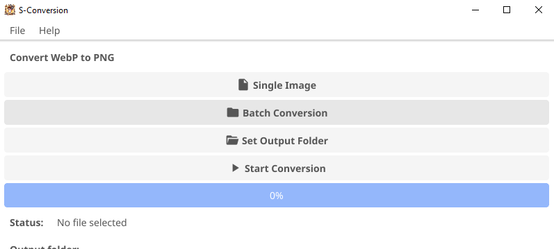
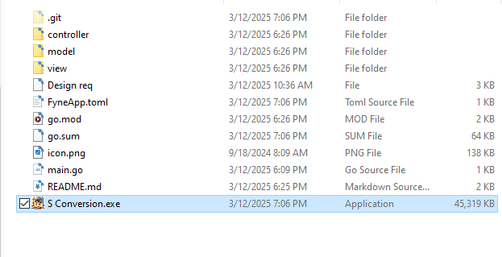
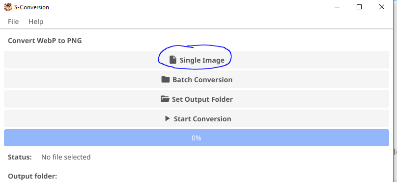
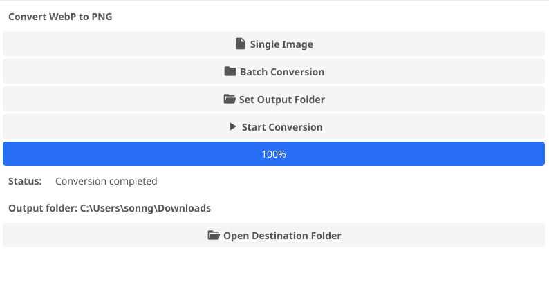

# S-Conversion: A Tool to convert image


## Table of Contents

- [S-Conversion: A Tool to convert image](#s-conversion-a-tool-to-convert-image)
  - [Table of Contents](#table-of-contents)
  - [Overview](#overview)
  - [Motivation and Plans](#motivation-and-plans)
  - [Features](#features)
  - [Installation](#installation)
    - [Window](#window)
    - [Build](#build)
  - [Usage](#usage)
    - [Single file conversion](#single-file-conversion)
    - [Batch file conversion](#batch-file-conversion)
  - [Contributing](#contributing)
  - [Known Issues](#known-issues)
  - [Acknowledgement](#acknowledgement)
  - [License](#license)
  - [Contact](#contact)


## Overview
The **S-Conversion** project is designed to convert `webp` to `.png` format.

## Motivation and Plans
As a casual user of **ChatGPT** and other web-based ai tool. One of the most common thing I do is to generate image. Images created often in `webp` format. However, standard format for 2d image in *gamedev* is often `.png`.

I often use free website to convert (e.g: https://convertio.co/webp-png/). However, they often put limit per day or super slow. In the other hand, image format conversion is frequently in need. Thus, I decided to make my own tool. This also make sure image asset are not leaked elsewhere as the tool work **only** in local machine.

Although currently this tool only support `webp` and `.png`. I intent to develop a more complex utilities that convert more formats, include but not excluded to *audios*, *movies*, etc. 

## Features
- Supports multiple file os
- Easy-to-use GUI
- Convert all image in specific folders


## Installation

The only build we had now is for Window
### Window
Download the prebuilt binary in the `Release` section

### Build
The project use `fyne` to build. Clone the project. Then run the following

```
go mod tidy
go install fyne.io/fyne/v2/cmd/fyne@latest // To install fyne
fyne package -os windows //modify based on your platform
```
You can refer to this link: https://docs.fyne.io/started/packaging.html to learn more about fyne packing for Desktop.

## Usage

After the build completed, you can open the `app` by open the binary file

### Single file conversion
1. Click on the button


2. Set the output folder (optionally, by default the output folder would be the same as the input image).
3. Click **Start Conversion** and wait until finish
4. You can quickly open the Output Folder by the `Open Destionation Folder`

### Batch file conversion

You can select a **folder** instead. By doing so you will convert ALL **.webp** image in that folder (**not recursively**). The current limit is *1000* images and **1000MB** per image

Use the same method as [Single file conversion](#single-file-conversion) but use **Batch Conversion** button instead.

## Contributing
We welcome contributions to the S-Conversion project. To contribute, please follow these steps:

1. Fork the repository
2. Create a new branch (`git checkout -b feature-branch`)
3. Make your changes
4. Commit your changes (`git commit -m 'Add new feature'`)
5. Push to the branch (`git push origin feature-branch`)
6. Create a pull request

## Known Issues

I don't have access to Mac and Linux at the moment so I couldn't test on these OS. If you are willing to test then I would gladly appreciate!

## Acknowledgement
- Fyne GUIToolkit and Fyne Toolkit discord
- The app is created in `golang`
- Cursor IDE and other AI Tools
## License
This project is licensed under the MIT License.

## Contact
For any questions or feedback, please contact us at [sonnguyen9800@gmail.com](mailto:sonnguyen9800@gmail.com).
